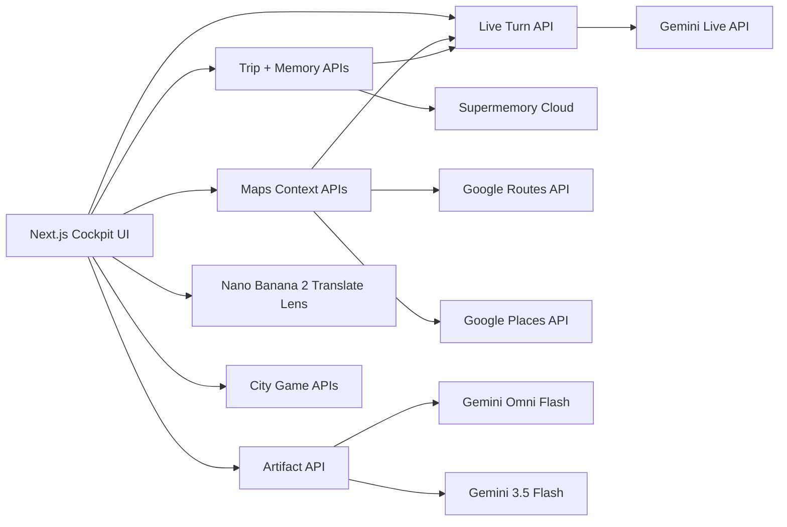

# Lens Architecture

Lens is a PC-first prototype for a context-aware AI travel companion. It combines uploaded video replay, persistent trip memory, route/place context, and live AI guidance so the assistant can answer travel questions with continuity.

## System Shape



## Frontend

The main cockpit lives in `src/app/page.tsx`.

It has five working areas:

- **Trip Setup**: itinerary, hotel, budget, diet, luggage, language, and constraints.
- **Video Replay**: uploaded clips are played locally and sampled into 768x768 JPEG frames at 1 FPS.
- **Live Assistant**: sends the current frame, user question, trip id, memory context, and route context into the live turn flow.
- **Location + Route Context**: manual Bengaluru presets, transit-first route refresh, nearby places, and Maps status.
- **Memory Evidence / Travel Cards**: shows Supermemory snippets, Maps evidence, Omni Flash visual cards, and Gemini 3.5 Flash text summaries.

## Backend APIs

All regular APIs use Next App Router route handlers.

- `POST /api/trips`: creates a trip and seeds Supermemory.
- `POST /api/trips/:tripId/memories`: stores additional trip memory.
- `POST /api/trips/:tripId/query-context`: retrieves Supermemory context.
- `POST /api/live/turn`: retrieves memory and sends the visual/text turn to Gemini Live.
- `POST /api/artifacts`: routes visual/video card requests to Gemini Omni Flash and booking summaries to Gemini 3.5 Flash.
- `POST /api/visual-translation`: analyzes a deliberate phone capture with Gemini 3.5 Flash and renders a translated visual copy with Nano Banana 2.
- `POST /api/games/session` and `POST /api/games/attempt`: create and validate session-scoped public city photo hunts.
- `POST /api/maps/context`: returns combined route, nearby places, and Maps evidence.
- `POST /api/maps/route`: calls Google Routes API.
- `POST /api/maps/nearby`: calls Google Places Nearby Search.

There is also an optional custom WebSocket server in `server.mjs` for `/api/live`. The default dev path uses stock Next with HTTP fallback.

## Data Context

### Trip Memory

Supermemory is the canonical durable memory layer. Trip memories are tagged with:

- `user:{id}`
- `trip:{id}`
- `city:india`
- optional domain tags like `food`, `route`, `booking`, `constraint`, `place`

The live turn retrieves Supermemory context before calling Gemini, then the UI shows the exact profile facts/snippets in the Memory Evidence panel.

### Maps Context

Maps context is deterministic and server-side:

- Routes API is called with `TRANSIT` first.
- If transit is unavailable, walking is attempted and marked as fallback.
- Places Nearby Search fetches useful local context around the origin preset.
- Missing Maps credentials produce a visible disabled state.
- The default auth path uses a Google Maps Platform API key. Set `GOOGLE_MAPS_AUTH_MODE=oauth` with `GOOGLE_MAPS_OAUTH_TOKEN`, `GOOGLE_APPLICATION_CREDENTIALS`, or `GOOGLE_MAPS_SERVICE_ACCOUNT_JSON` for server-side OAuth testing.
- `MAPS_FIXTURE_MODE=true` produces clearly labeled Bengaluru fixture data.

Raw Google Maps responses are not stored in Supermemory. Only the current route/place summary is injected into live turns and shown in evidence.

### Live Turn

The live turn payload includes:

- trip id and user id
- current user question
- video timestamp
- latest sampled video frame
- optional Maps route context

The Gemini prompt includes:

- travel companion role
- trip memory
- route and nearby-place context
- current timestamp/question

No silent fallback is used. If Gemini, Supermemory, or Maps keys are missing, the UI reports that directly.

## Artifact Boundaries

`src/lib/omni-flash.ts` defines the Gemini Omni Flash visual artifact boundary.

Current behavior:

- Visual travel artifacts use Omni Flash: phrase cards, route cards, menu explainers, etiquette notes, and alerts.
- If `OMNI_FLASH_ENABLED=false`, visual artifact creation returns an explicit disabled card.
- If enabled but `GEMINI_API_KEY` is missing, the UI reports the missing key.

Intended Omni Flash tasks:

- route cards
- phrase cards
- menu explainers
- etiquette notes
- travel alerts

## Cloud Text and Visual Generation

- Booking summaries use Gemini 3.5 Flash.
- The phone Translate Lens uses Gemini 3.5 Flash for structured extraction and Nano Banana 2 for faithful visual editing after an explicit camera capture.
- City games use Gemini 3.5 Flash for quest generation and one-off photo validation. Attempt images are not retained.

## Environment

```bash
GEMINI_API_KEY=
SUPERMEMORY_API_KEY=
GOOGLE_MAPS_API_KEY=
GOOGLE_MAPS_AUTH_MODE=auto
GOOGLE_MAPS_OAUTH_TOKEN=
GOOGLE_MAPS_OAUTH_SCOPES=https://www.googleapis.com/auth/maps-platform
# Optional alternative to GOOGLE_APPLICATION_CREDENTIALS:
GOOGLE_MAPS_SERVICE_ACCOUNT_JSON=
MAPS_FIXTURE_MODE=false
MAPS_DEFAULT_LANGUAGE=en-IN
MAPS_DEFAULT_UNITS=METRIC
GEMINI_LIVE_MODEL=gemini-3.1-flash-live-preview
GEMINI_MEMORY_MODEL=gemini-3.5-flash
GEMINI_IMAGE_MODEL=gemini-3.1-flash-image
GEMINI_GAME_MODEL=gemini-3.5-flash
OMNI_FLASH_ENABLED=false
OMNI_FLASH_MODEL=gemini-omni-flash-preview
```

## Run

```bash
npm install
npm run dev
```

Default URL:

```text
http://localhost:3000
```

Alternative port:

```bash
npm run dev -- -p 3001
```

Optional WebSocket runner:

```bash
npm run dev:ws
```

## Test Scenarios

- **No keys**: app should show visible disabled states for Supermemory, Gemini Live, Omni Flash, Maps, visual translation, and city games.
- **Maps fixture**: set `MAPS_FIXTURE_MODE=true`, refresh route context, and verify the fixture route card appears.
- **Real Maps**: set `GOOGLE_MAPS_API_KEY`, refresh Indiranagar Metro to Cubbon Park, and verify ETA, distance, next step, nearby places, and Maps evidence.
- **Live context**: save trip, refresh route context, upload a clip or use an empty frame, ask "Which way now?", and confirm the answer includes memory and route context.
- **Build checks**:

```bash
npm run lint
npm run build
```
